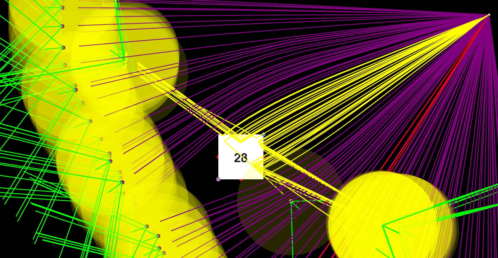

# Projectile Sim
A little project that I made for fun.

It has basic things like bullets, rockets (with thrust) and even heat seeking missile.

This project is using arcade.

This started around 6-7 weeks ago when I wanted to make a basic physics sim.

Then I landed on this, a projectile sim with gravity, drag, and also fake heat.

*No AI was used in this project.*

I'm astonished that we even have to say that.